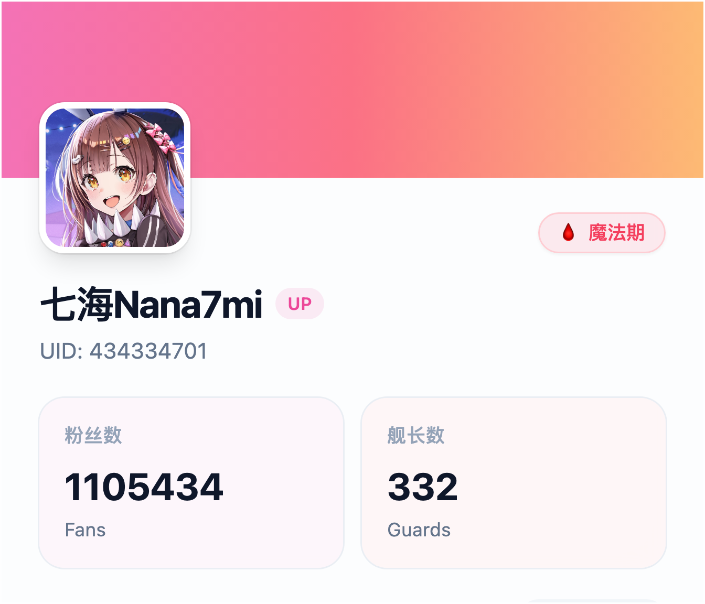

# VtuberBot

用于视奸喜欢的vtuber的qqbot

## 功能描述

- [ ] 订阅新主播
- [ ] 取消订阅主播
- [ ] 查询正在开播主播
- [ ] 主播礼物流水排名
- [ ] 主播个人信息展示

## 样式展示

个人资料卡片（点击展开）

## 部署方式

Napcat设置websocket客户端，设置url：ws://host.docker.internal:8080/onebot/v11/ws
然后启动go run ./cmd/main.go 命令行显示已连接说明连接成功

给qqbot输入/profile <uid>返回主播对应的profile

## 架构设计
